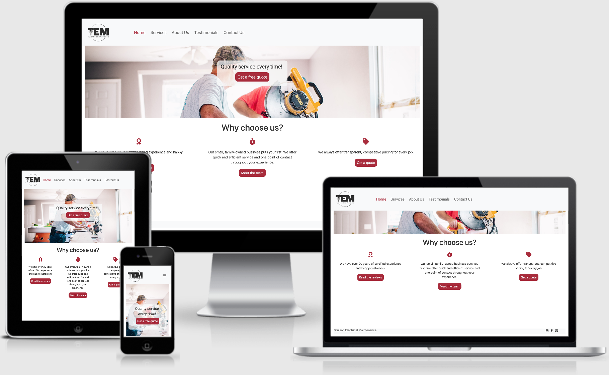

# Toulson Electrical Maintenance
## Milestone 1 Project

[View the project here.](https://8000-d4a8b9e2-c1fb-4bf4-9065-f96fc41b277a.ws-eu01.gitpod.io/)

This is a website created for my friend's company. It is responsive and accessible on different devices, and aims to provide information about the company and a way to make contact for both new and existing clients.
<h2 align="center"></h2>

## User Experience (UX)

-   ### User Goals

    -   #### First Time Visitors / New Clients

        1. First time visitors should be able to quickly see the purpose of the website (a maintenance company website with information about the business and how to get in touch).
        2. First time visitors should be able to easily navigate throughout the site using the navbar to find what they are looking for.
        3. First time visitors will want to see why this company is different from similar companies, will want to read testimonials to find out if the company is reliable, and will want to see social media pages to see examples of work.

    -   #### Returning Visitors / Clients

        1. Returning Visitors may come back to the page to find contact details to get in touch.
        2. Returning Visitors will want to access social media links to follow the business online.

-   ### Design
    -   #### Colour Scheme
        -   The main colours used are greys (light Bootstrap navbar colours) with a soft red accent colour throughout the page (#A86067).
    -   #### Typography
        -   The Roboto font is the main font used throughout the whole website with Sans-Serif as the fallback font in case for any reason the font isn't being imported into the site correctly. Roboto is a clean font in the sans-serif typeface family which was developed by Google as the system font for its mobile operating system Android.
    -   #### Imagery
        -   There is a background hero image for 4 of the 5 pages, which is designed to attract users' attention and add imagery to an otherwise content-heavy website. The images have been taken from [Unsplash](https://unsplash.com/) to provide a visual of the services provided by the company.

*   ### Wireframes

    -   Wireframes were made using Balsamiq:
    <h6 align="center"></h6>

## Features

-   Responsive on all device sizes

-   Includes a form to get in touch with the company. I've used Code Institute's formdump page for now since this website will not be used by actual clients.

## Technologies Used

-   Responsive on all device sizes

### Languages Used

-   [HTML5](https://en.wikipedia.org/wiki/HTML5)
-   [CSS3](https://en.wikipedia.org/wiki/Cascading_Style_Sheets)

### Frameworks, Libraries & Programs Used

1. [Bootstrap 4.2.1:](https://getbootstrap.com/docs/4.2/getting-started/introduction/)
    - Bootstrap was used to assist with the responsiveness and styling of the website and for the code for the navbar and footer.
1. [Hover.css:](https://ianlunn.github.io/Hover/)
    - Hover.css was used on the navbar titles and on the social media icons in the footer. 
1. [Google Fonts:](https://fonts.google.com/)
    - Google fonts were used to import the 'Roboto' font into the style.css file which is used on all pages throughout the project.
1. [Font Awesome:](https://fontawesome.com/)
    - Font Awesome was used in the index, testimonials, and contact pages to add icons for aesthetic and UX purposes.
1. [jQuery:](https://jquery.com/)
    - jQuery came with Bootstrap to make the navbar responsive but was also used for the smooth scroll function in JavaScript.
1. [Git](https://git-scm.com/)
    - Git was used for version control by utilizing the Gitpod terminal to commit to Git and Push to GitHub.
    - As this was my first project, I committed my changes and did not realise I had to push to Git each time. The Git Commits I made which I eventually pushed to Github were 7549724, e6554ec, 54ef62b, cle70ec, d38f42b, b5bceca, 4561e57, and 2c2141a. I reached out to Student Support once I realised my error and I was advised to add this to my README for the assessors to be made aware of my learning curve.
1. [GitHub:](https://github.com/)
    - GitHub is used to store the projects code after being pushed from Git.
1. [Figma:](https://www.figma.com/)
    - Figma was used by my sister, Nele Groosman, to create the logo for the website.
1. [Balsamiq:](https://balsamiq.com/)
    - Balsamiq was used to create the wireframes during the design process.

## Testing

The W3C Markup Validator and W3C CSS Validator Services were used to validate every page of the project to ensure there were no syntax errors in the project.

-   [W3C Markup Validator](https://validator.w3.org/#validate_by_input) - I could not figure out how to link the results here, but there are no errors.
-   [W3C CSS Validator](https://jigsaw.w3.org/css-validator/#validate_by_input) - I could not figure out how to link the results here, but there are no errors.

### Testing User Stories from User Experience (UX) Section

-   #### First Time Visitor Goals

    1. First time visitors should be able to quickly see the purpose of the website (a maintenance company website with information about the business and how to get in touch).

        1. Upon entering the site, users will see the business' logo (which has the name of the company included) and a clear navbar.
        2. The main hero image shows workers at work, providing one of the services offered by this business.
        3. A call to action (to get in touch) is immediately visible in the large hero image, which provides a fast way to get in touch.
       
    2. First time visitors should be able to easily navigate throughout the site using the navbar to find what they are looking for.

        1. At the top of each page there is an easy navigation bar, with each link describing what the page they will end up at clearly.
        2. The logo can be clicked on at any point to return to the index page.

    3. First time visitors will want to see why this company is different from similar companies, will want to read testimonials to find out if the company is reliable, and will want to see social media pages to see examples of work.
        1. Upon entering the site, there is a list of reasons why the business is different to other similar businesses. Each reason also has a link to additional pages for more detailed information.
        2. There is a full page dedicated to testimonials so users can read about what clients think.
        2. The user can also scroll to the bottom of any page on the site to locate social media links in the footer.

-   #### Returning Visitor Goals

    1. Returning Visitors may come back to the page to find contact details to get in touch.

        1. The first call to action in the main page is a link to the contact page to get in touch for a quote and you can get there by clicking on "Contact Us" in the navigation bar as well.
        2. On the "Contact Us" page there are multiple ways to get in touch: they can call the number listed, email the email address listed, or fill out the form to send a message via the form.

    2. Returning Visitors will want to access social media links to follow the business online.

        1. The footer on every page has links to the business' social media pages.
        2. The "Contact Us" page also has the social media links in the main content of the page.

### Further Testing

-   The Website was tested on Google Chrome, Safari, and Internet Explorer browsers.
-   The website was viewed on a variety of devices such as Desktop, Laptop, iPad, and iPhone6.
-   Friends and family members were asked to review the site and documentation to point out any bugs and/or user experience issues.
-   All the links were tested in all browsers and device types.

### Known Bugs

-   The links to social media pages work but are not actual social media pages as this business does not exist on the internet. I've created social media pages but they will be empty.

-   The form on the "contact" page submits information to the Code Institute formdump site as the site is not being used by the business.

### Functionalities To Be Added

-   Eventually I would like to add functionality for the "Contact Us" page to display a "Thank you, we will be in touch shortly!" message once the form has been submitted. I have not learned how to do this yet so I will return to do this eventually.

## Deployment

### GitHub Pages

The project was deployed to GitHub Pages using the following steps...

1. Log in to GitHub and locate the [GitHub Repository](https://github.com/)
2. At the top of the Repository (not top of page), locate the "Settings" Button on the menu.
    - Alternatively Click [Here](https://raw.githubusercontent.com/) for a GIF demonstrating the process starting from Step 2.
3. Scroll down the Settings page until you locate the "GitHub Pages" Section.
4. Under "Source", click the dropdown called "None" and select "Master Branch".
5. The page will automatically refresh.
6. Scroll back down through the page to locate the now published site [link](https://github.com) in the "GitHub Pages" section.

### Forking the GitHub Repository

By forking the GitHub Repository we make a copy of the original repository on our GitHub account to view and/or make changes without affecting the original repository by using the following steps...

1. Log in to GitHub and locate the [GitHub Repository](https://github.com/)
2. At the top of the Repository (not top of page) just above the "Settings" Button on the menu, locate the "Fork" Button.
3. You should now have a copy of the original repository in your GitHub account.

### Making a Local Clone

1. Log in to GitHub and locate the [GitHub Repository](https://github.com/)
2. Under the repository name, click "Clone or download".
3. To clone the repository using HTTPS, under "Clone with HTTPS", copy the link.
4. Open Git Bash.
5. Change the current working directory to the location where you want the cloned directory to be made.
6. Type `git clone`, and then paste the URL you copied in Step 3.

```
$ git clone https://github.com/YOUR-USERNAME/YOUR-REPOSITORY
```

7. Press Enter. Your local clone will be created.

```
$ git clone https://github.com/YOUR-USERNAME/YOUR-REPOSITORY
> Cloning into `CI-Clone`...
> remote: Counting objects: 10, done.
> remote: Compressing objects: 100% (8/8), done.
> remove: Total 10 (delta 1), reused 10 (delta 1)
> Unpacking objects: 100% (10/10), done.
```

Click [Here](https://help.github.com/en/github/creating-cloning-and-archiving-repositories/cloning-a-repository#cloning-a-repository-to-github-desktop) to retrieve pictures for some of the buttons and more detailed explanations of the above process.

## Credits

### Code

-   [Bootstrap4](https://getbootstrap.com/docs/4.2/getting-started/introduction/): The Bootstrap Library was used throughout the project, mainly to make the site responsive using the Bootstrap Grid System and to get code for the Navbar and footer.

-   [W3Schools](https://www.w3schools.com/css/): W3Schools was used as a resource throughout the project. No code was copied directly from the site.

### Content

-   All content was written by the developer with the input from my friend who owns the business.

-   The social media pages were created by the developer and are not used by the business (they are blank but exist for purposes of the project)

### Media

-   The logo for the business was created by Nele Groosman, sister of the developer, for use in this project.

-   Hero image on "index" page: Photo by Annie Gray on [Unsplash](https://unsplash.com/s/photos/worker?utm_source=unsplash&amp;utm_medium=referral&amp;utm_content=creditCopyText)

-   Hero image on "services" page: Photo by Creatv Eight on [Unsplash](https://unsplash.com/s/photos/kitchen?utm_source=unsplash&amp;utm_medium=referral&amp;utm_content=creditCopyText)

-   Hero image on "about" page: Photo by Greyson Joralemon on [Unsplash](https://unsplash.com/s/photos/construction?utm_source=unsplash&amp;utm_medium=referral&amp;utm_content=creditCopyText)

-   Hero image on "testimonials" page: Photo by Becca Tapert on [Unsplash](https://unsplash.com/s/photos/happy-in-kitchen?utm_source=unsplash&amp;utm_medium=referral&amp;utm_content=creditCopyText)

-   The image of the business owner on the "about" page was taken by the developer.

### Acknowledgements

-   My mentor for reviewing my idea and wireframes for the project to make sure I was heading in the right direction with the project.

-   Peers in the Slack community who helped with a few questions along the way.

-   Student Care for advising me on my Git Commit error (I Committed but did not Push to Github for the first 8 commits: 7549724, e6554ec, 54ef62b, cle70ec, d38f42b, b5bceca, 4561e57, and 2c2141a). They advised me to simply put this in the README for the assessors to know about my learning curve during my first project.

-   My sister for making the logo for this project.

-   My friend for allowing me to make a website for his business.