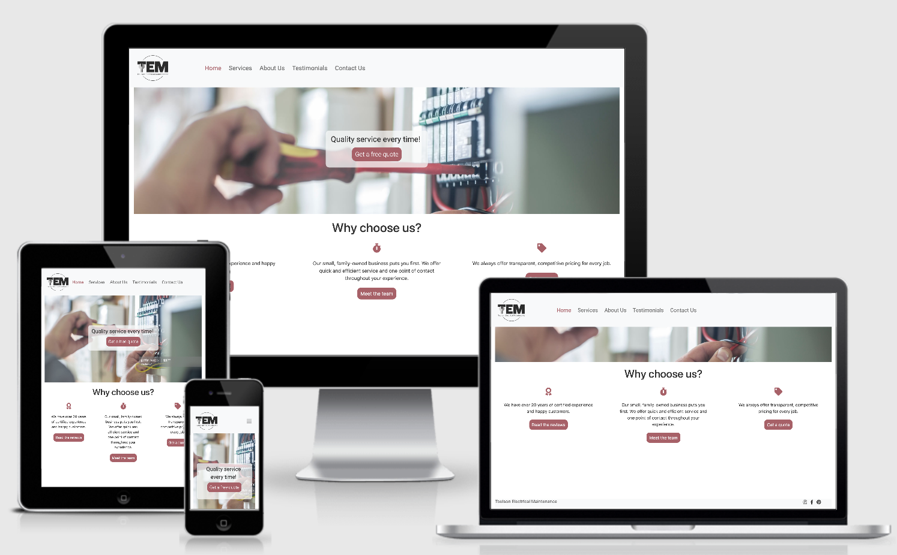

# Toulson Electrical Maintenance
## Milestone 1 Project

[View the project here.](https://8000-d4a8b9e2-c1fb-4bf4-9065-f96fc41b277a.ws-eu01.gitpod.io/)

This is a website created for my friend's company. It is responsive and accessible on different devices, and aims to provide information about the company and a way to make contact for both new and existing clients.
<h2 align="center"></h2>

## User Experience (UX)

-   ### User Goals

    -   #### First Time Visitors / New Clients

        1. First time visitors should be able to quickly see the purpose of the website (a maintenance company website with information about the business and how to get in touch).
        2. First time visitors should be able to easily navigate throughout the site using the navbar to find what they are looking for.
        3. First time visitors will want to see why this company is different from similar companies, will want to read testimonials to find out if the company is reliable, and will want to see social media pages to see examples of work.

    -   #### Returning Visitors / Clients

        1. Returning Visitors may come back to the page to find contact details to get in touch.
        2. Returning Visitors will want to access social media links to follow the business online.

-   ### Design
    -   #### Colour Scheme
        -   The main colours used are greys (light Bootstrap navbar colours) with a soft red accent colour throughout the page (#A86067).
    -   #### Typography
        -   The Roboto font is the main font used throughout the whole website with Sans-Serif as the fallback font in case for any reason the font isn't being imported into the site correctly. Roboto is a clean font in the sans-serif typeface family which was developed by Google as the system font for its mobile operating system Android.
    -   #### Imagery
        -   There is a background hero image for 4 of the 5 pages, which is designed to attract users' attention and add imagery to an otherwise content-heavy website. The images have been taken from Getty Images to provide a visual of the services provided by the company.

*   ### Wireframes

    -   Wireframes were made using Balsamiq:
    <h6 align="center"></h6>

## Features

-   Responsive on all device sizes

-   Includes a form to get in touch with the company. I've used Code Institute's formdump page for now since this website will not be used by actual clients.

## Technologies Used

-   Responsive on all device sizes

### Languages Used

-   [HTML5](https://en.wikipedia.org/wiki/HTML5)
-   [CSS3](https://en.wikipedia.org/wiki/Cascading_Style_Sheets)

### Frameworks, Libraries & Programs Used

1. [Bootstrap 4.2.1:](https://getbootstrap.com/docs/4.2/getting-started/introduction/)
    - Bootstrap was used to assist with the responsiveness and styling of the website and for the code for the navbar and footer.
1. [Hover.css:](https://ianlunn.github.io/Hover/)
    - Hover.css was used on the navbar titles and on the social media icons in the footer. 
1. [Google Fonts:](https://fonts.google.com/)
    - Google fonts were used to import the 'Roboto' font into the style.css file which is used on all pages throughout the project.
1. [Font Awesome:](https://fontawesome.com/)
    - Font Awesome was used in the index, testimonials, and contact pages to add icons for aesthetic and UX purposes.
1. [jQuery:](https://jquery.com/)
    - jQuery came with Bootstrap to make the navbar responsive but was also used for the smooth scroll function in JavaScript.
1. [Git](https://git-scm.com/)
    - Git was used for version control by utilizing the Gitpod terminal to commit to Git and Push to GitHub.
    - As this was my first project, I committed my changes and did not realise I had to push to Git each time. The Git Commits I made which I eventually pushed to Github were 7549724, e6554ec, 54ef62b, cle70ec, d38f42b, b5bceca, 4561e57, and 2c2141a. I reached out to Student Support once I realised my error and I was advised to add this to my README for the assessors to be made aware of my learning curve.
1. [GitHub:](https://github.com/)
    - GitHub is used to store the projects code after being pushed from Git.
1. [Figma:](https://www.figma.com/)
    - Figma was used by my sister, Nele Groosman, to create the logo for the website.
1. [Balsamiq:](https://balsamiq.com/)
    - Balsamiq was used to create the wireframes during the design process.

## Testing

The W3C Markup Validator and W3C CSS Validator Services were used to validate every page of the project to ensure there were no syntax errors in the project.

-   [W3C Markup Validator](https://validator.w3.org/#validate_by_input) - I could not figure out how to link the results here, but there are no errors.
-   [W3C CSS Validator](https://jigsaw.w3.org/css-validator/#validate_by_input) - I could not figure out how to link the results here, but there are no errors.

